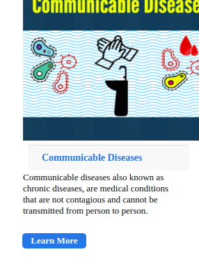

<h> About Communicare</h>

* is an apllication where: 
Users can create an account and log in. 
Users can view a listing of the most prevalent communicable diseases.
Users can view areas where the communicable diseases have affected the most
Users can view more details about a specific communicable disease
Users can view more details about a specific affected area
Users can give their reviews of how they’d like to help eradicate the disease in a specific area
Users can view a map showing the analysis of communicable diseases affecting a specific area
Users can offer donations to areas affected by the diseases.

Click on the link to create an account and view how the application works: <a href ="https://communicare-revl.vercel.app/"> Communicare app </a>

## Implementing qr code functionality
* I have implemented qr code functionality in this ruby on rails project by allowing users to scan the qr code in communicable diseases where after user has scanned he will be able to extract the the name of the communicable disease and the Id of the disease 

# Here are the screen shots 
 

* The user will visit the application and browse the blog where he can learn more about communicable disease. there is where he will view the list of communicable disease with the qr code to scan

